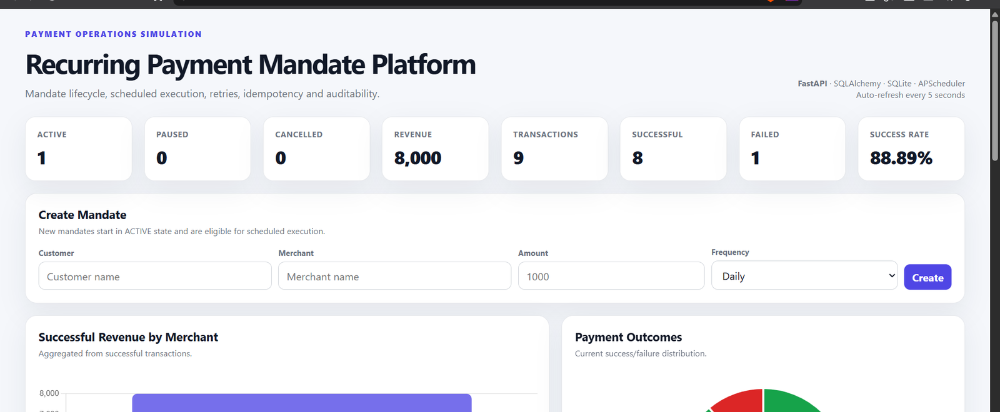
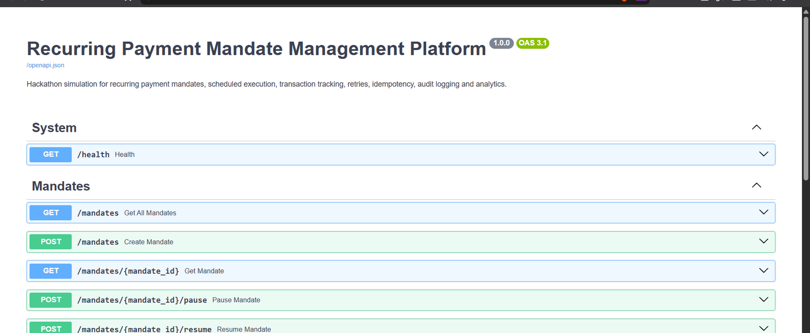
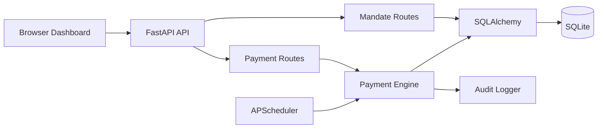

# Recurring Payment Mandate Platform

[](https://github.com/RoycePlayzz/recurring-payment-mandate-platform/actions/workflows/ci.yml)

A backend-focused payment operations simulation built with **Python, FastAPI, SQLAlchemy, SQLite, and APScheduler**.

The project models recurring-payment operations end to end: mandate lifecycle management, scheduled execution, transaction tracking, bounded retries, idempotency, audit events, and merchant-level analytics.

## What it demonstrates

- REST API design with FastAPI and OpenAPI/Swagger
- Persistent application state with SQLAlchemy and SQLite
- Mandate lifecycle and state transitions
- Scheduled background execution with APScheduler
- Idempotent payment requests using an `Idempotency-Key`
- Transaction IDs, failure handling, and bounded retries
- Dedicated audit logging for operational events
- Merchant-level success, failure, revenue, and success-rate metrics
- Browser and API-layer request validation
- Automated testing with pytest

## Screenshots

### Operations dashboard



### API documentation



## Architecture



## Project structure

```text
app/
├── audit.py
├── database.py
├── main.py
├── models.py
├── payment_engine.py
├── scheduler.py
├── schemas.py
└── routes/
    ├── mandates.py
    └── payments.py
static/
├── script.js
└── style.css
templates/
└── index.html
tests/
├── conftest.py
└── test_payment_engine.py
.github/
└── workflows/
    └── ci.yml
docs/
└── screenshots/
    ├── dashboard.png
    └── api-docs.png
.gitignore
.gitattributes
LICENSE
README.md
requirements.txt
```

## API surface

| Method | Endpoint | Purpose |
|---|---|---|
| GET | `/health` | Health check |
| POST | `/mandates` | Create a mandate |
| GET | `/mandates` | List mandates |
| GET | `/mandates/{mandate_id}` | Read one mandate |
| POST | `/mandates/{mandate_id}/pause` | Pause a mandate |
| POST | `/mandates/{mandate_id}/resume` | Resume a mandate |
| POST | `/mandates/{mandate_id}/cancel` | Cancel a mandate |
| POST | `/payments/execute/{mandate_id}` | Execute a payment attempt |
| POST | `/transactions/{transaction_id}/retry` | Retry a failed transaction |
| GET | `/transactions` | List recent transactions |
| GET | `/transactions/{transaction_id}` | Read one transaction |
| GET | `/dashboard` | Operational summary |
| GET | `/merchant-analytics` | Merchant-level metrics |
| GET | `/audit-logs` | Recent audit events |

Interactive documentation is available at `http://127.0.0.1:8000/docs` when the application is running.

## Idempotency

The payment execution endpoint accepts an `Idempotency-Key` header. Reusing the same key returns the existing transaction instead of creating a second transaction record.

```text
Request 1: Idempotency-Key = payment-123
        |
        v
Create and persist the transaction
        |
Request 2: Idempotency-Key = payment-123
        |
        v
Return the existing transaction
```

Scheduled executions use a deterministic idempotency key derived from the mandate and scheduled timestamp.

## Retry model

A failed transaction can be retried up to three times after the original attempt. Each retry is persisted as a separate transaction and records the incremented retry count.

## Local setup

### Requirements

- Python **3.13**
- Git

### Windows PowerShell

```powershell
py -3.13 -m venv venv
.\venv\Scripts\Activate.ps1
python -m pip install -r requirements.txt
```

Start the application:

```powershell
python -m uvicorn app.main:app --reload
```

Open:

- Dashboard: http://127.0.0.1:8000/
- Swagger UI: http://127.0.0.1:8000/docs
- Health check: http://127.0.0.1:8000/health

## Testing

Run the test suite with:

```powershell
python -m pytest -q
```

GitHub Actions runs the same test suite on pushes and pull requests targeting `main`.

## Design notes and scope

This is intentionally a **local simulation/prototype**. It does not connect to a real bank, UPI rail, card network, payment processor, or production payment system.

The project uses a local SQLite database and deterministic scheduler idempotency keys so the payment workflow can be demonstrated without external services.

## License

Released under the MIT License. See `LICENSE`.
