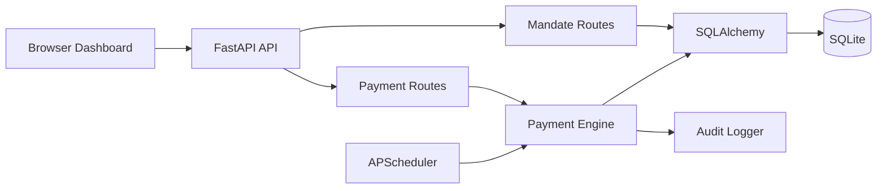

# Recurring Payment Mandate Platform

A backend-focused payment operations simulation built with **Python, FastAPI, SQLAlchemy, SQLite, and APScheduler**.

The project models the operational side of recurring payments: mandate lifecycle management, scheduled execution, transaction tracking, retries, idempotency, audit events, and merchant-level analytics.

## Key Features

- Create, pause, resume, and cancel recurring payment mandates
- Execute scheduled payment attempts with a background scheduler
- Persist mandates, transactions, and audit events with SQLAlchemy + SQLite
- Generate unique transaction IDs for payment attempts
- Protect payment execution with an `Idempotency-Key`
- Track failed attempts and support bounded retries
- Record operational events in a dedicated audit log
- Aggregate success, failure, revenue, and success-rate metrics by merchant
- Expose a REST API with FastAPI's OpenAPI/Swagger documentation
- Provide a lightweight browser dashboard using Jinja2, vanilla JavaScript, and Chart.js
- Validate request data at both the browser and API layers

## Architecture



## Project Structure

```text
app/
├── audit.py
├── database.py
├── main.py
├── models.py
├── payment_engine.py
├── scheduler.py
├── schemas.py
└── routes/
    ├── mandates.py
    └── payments.py
static/
├── script.js
└── style.css
templates/
└── index.html
tests/
├── conftest.py
└── test_payment_engine.py
.gitignore
LICENSE
README.md
requirements.txt
```

## Main API Endpoints

| Method | Endpoint | Purpose |
|---|---|---|
| GET | `/health` | Health check |
| POST | `/mandates` | Create a mandate |
| GET | `/mandates` | List mandates |
| GET | `/mandates/{mandate_id}` | Read one mandate |
| POST | `/mandates/{mandate_id}/pause` | Pause a mandate |
| POST | `/mandates/{mandate_id}/resume` | Resume a mandate |
| POST | `/mandates/{mandate_id}/cancel` | Cancel a mandate |
| POST | `/payments/execute/{mandate_id}` | Execute a payment attempt |
| POST | `/transactions/{transaction_id}/retry` | Retry a failed transaction |
| GET | `/transactions` | List recent transactions |
| GET | `/transactions/{transaction_id}` | Read one transaction |
| GET | `/dashboard` | Operational summary |
| GET | `/merchant-analytics` | Merchant-level metrics |
| GET | `/audit-logs` | Recent audit events |

Interactive API documentation is available at `/docs` after starting the application.

## Idempotency

The payment execution endpoint accepts an optional `Idempotency-Key` header.

```text
Request 1: Idempotency-Key = payment-123
        |
        v
Create and persist the transaction
        |
Request 2: Idempotency-Key = payment-123
        |
        v
Return the existing transaction
```

This prevents the same logical request from creating multiple transaction records. Scheduled executions use a deterministic key based on the mandate and scheduled timestamp.

## Retry Model

A failed transaction can be retried up to three times after the original attempt. Each retry is stored as a separate transaction record and carries the incremented retry count.

## Local Setup

### Requirements

- Python **3.13**
- Git (for version control)

### Windows PowerShell

Create the virtual environment with Python 3.13:

```powershell
py -3.13 -m venv venv
.\venv\Scripts\Activate.ps1
python -m pip install -r requirements.txt
```

Start the application:

```powershell
python -m uvicorn app.main:app --reload
```

Open:

- Dashboard: http://127.0.0.1:8000/
- Swagger UI: http://127.0.0.1:8000/docs
- Health check: http://127.0.0.1:8000/health

## Testing

Run the automated test suite with:

```powershell
python -m pytest -q
```

The current suite covers payment execution, idempotency behavior, failure handling, retry tracking, and schedule advancement.

## Design Notes

This project is intentionally a **local simulation/prototype**. It does not connect to a real bank, UPI rail, card network, payment processor, or production payment system.

The payment engine uses deterministic scheduler idempotency keys and a local SQLite database so the behavior can be demonstrated without external services.

## License

Released under the MIT License. See `LICENSE`.
